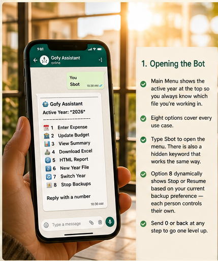
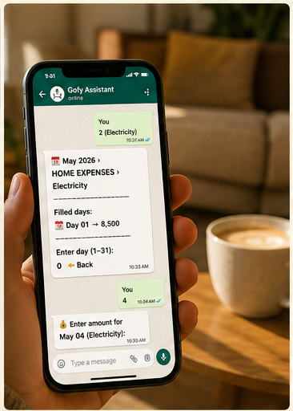
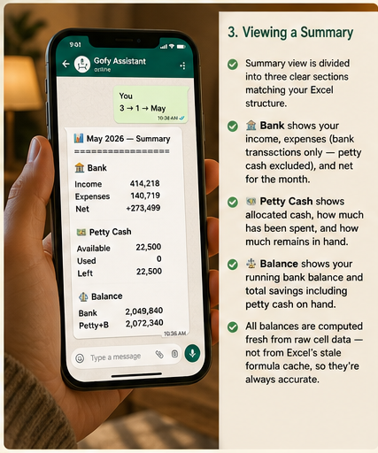

<div align="center">


# 🤖 Saving-Bot-v0.1

**A private WhatsApp budget management bot for your homelab.**  
No cloud. No subscriptions. No fees. Your data stays home.

[](https://nodejs.org)
[](https://github.com/pedroslopez/whatsapp-web.js)
[](https://docker.com)
[](https://github.com/exceljs/exceljs)
[]()

> Type **`Sbot`** on WhatsApp to open the menu and start managing your budget in seconds.

</div>

---

## 📖 Table of Contents

- [What Is This?](#-what-is-this)
- [Features](#-features)
- [Prerequisites](#-prerequisites)
- [Folder Structure](#-folder-structure)
- [Installation](#-installation)
- [Configuration](#-configuration)
- [Adding WhatsApp Numbers](#-adding-whatsapp-numbers-to-whitelist)
- [Creating Your Year File](#-creating-your-year-excel-file)
- [Bot Keywords](#-bot-keywords)
- [How It Works — Screenshot Walkthrough](#-how-it-works--screenshot-walkthrough)
- [HTML Reports](#-html-reports)
- [Scheduled Backups](#-scheduled-backups)
- [Troubleshooting](#-troubleshooting)

---

## 💡 What Is This?

Saving-Bot-v0.1 is a **self-hosted WhatsApp budget assistant** that runs on your homelab — Raspberry Pi, Mini PC, VPS, or any always-on Linux machine. It connects to WhatsApp using a second SIM number and lets authorised family members log expenses and view financial summaries through a guided menu.

```
Your Phone ──WhatsApp──► Bot Number ──► Homelab ──► Saving-<Year>.xlsx
```

Your financial data never leaves your network. No third-party APIs, no monthly fees.

---

## ✨ Features

| Feature | Description |
|---|---|
| 📅 **Expense Entry** | Section → Category → Day flow with existing entries shown |
| 🏦 **Budget Management** | Update bank balance, petty cash, and starting balance |
| 📊 **Summary Views** | Month-wise and year-wise with Bank / Petty Cash / Balance sections |
| 📎 **Excel Download** | Send live `.xlsx` directly to WhatsApp |
| 🌐 **HTML Reports** | Interactive charts, date-pivot tables, and visual analysis |
| 📋 **Year Template** | Create `Saving-<Year>.xlsx` from template without leaving WhatsApp |
| 🔄 **Year Switching** | Switch active year on the fly |
| ⏰ **Scheduled Backups** | Auto-send Excel at 4 fixed times daily (PKT) |
| ⏸ **Backup Toggle** | Each user controls their own backup schedule |
| 🔒 **Whitelist Only** | Completely silent to all non-authorised numbers |
| 🔑 **Dual Keywords** | `Sbot` (public) + a hidden keyword both open the menu |

---

## 🛠 Prerequisites

### Software

| Requirement | Version | Check |
|---|---|---|
| Docker | 20+ | `docker --version` |
| Docker Compose | v2+ | `docker compose version` |
| Git | Any | `git --version` (optional) |

> Docker installs Node.js 20 and Chromium automatically inside the container — nothing else needed on the host.

### Hardware

| Component | Minimum | Recommended |
|---|---|---|
| CPU | 1 core | 2 cores |
| RAM | 512 MB free | 1 GB free |
| Storage | 500 MB | 2 GB |
| Network | Always-on | Wired preferred |

Works on: Raspberry Pi 4 (2 GB+) · Mini PC (N100/N5095) · Any Ubuntu VPS · Old laptop

### WhatsApp

- A **second SIM/number** dedicated to the bot (any network)
- WhatsApp installed on a phone with that SIM — needed only for the **first QR scan**
- After scanning, the session is saved permanently — the phone can be put away

### Ports

No inbound ports required. The bot connects **outbound only** via HTTPS/WSS to WhatsApp servers.

### Docker Install (Ubuntu/Debian)

A convenience script is included:

```bash
bash pre-req/install-docker.sh
```

---

## 📁 Folder Structure

```
Saving-Bot-v0.1/
├── bot.js                  ← WhatsApp client + message routing
├── config.js               ← Loads .env, exposes settings + helpers
├── handler.js              ← Conversation state machine
├── excel.js                ← Excel read/write + HTML report generation
├── scheduler.js            ← Scheduled backup cron jobs
├── package.json
├── docker-compose.yml
├── .env                    ← ⚠️ YOUR config — never commit to Git
├── .env.example            ← Safe template — commit this instead
├── .gitignore              ← Protects .env, session/, Saving-Year/
├── README.md
├── Template.xlsx           ← Blank year template (do not modify)
├── Images/
│   ├── 1-Goofy-Bot.png
│   ├── 2-Opening-the-Bot.png
│   ├── 3-Entering-an-Expense.png
│   ├── 4-Expense-Result.png
│   ├── 5-Viewing_a_Summary.png
│   ├── 6-Year-Summary.png
│   └── 7-Year-Wise-Summary.png
├── pre-req/
│   └── install-docker.sh   ← Docker install script for Ubuntu/Debian
├── Saving-Year/
│   └── Saving-2026.xlsx    ← Active budget file (and future years)
├── session/                ← Auto-created: WhatsApp session data
└── bot_settings.json       ← Auto-created: active year + user prefs
```

---

## 🚀 Installation

### Step 1 — Copy files to your homelab

```bash
mkdir ~/Saving-Bot-v0.1 && cd ~/Saving-Bot-v0.1
# Copy all bot files here
```

### Step 2 — Install Docker (if needed)

```bash
bash pre-req/install-docker.sh
```

### Step 3 — Place your Excel file

```bash
mkdir -p Saving-Year
cp /path/to/Saving-2026.xlsx Saving-Year/Saving-2026.xlsx
# Template.xlsx should already be in the root folder
```

### Step 4 — Create your `.env` file

```bash
cp .env.example .env
nano .env          # fill in your phone numbers
```

See [Configuration](#-configuration) for what to put in it.

### Step 5 — Start the bot

```bash
docker compose up -d
docker compose logs -f saving-bot-v0.1
```

### Step 6 — Scan the QR code

The QR code prints in the logs on first start:

```
📱 Scan this QR code with the BOT WhatsApp number:

▄▄▄▄▄▄▄ ▄  ▄ ▄▄▄▄▄▄▄
...

Waiting for scan...
```

Open WhatsApp on the **bot's phone** → Settings → Linked Devices → Link a Device → Scan.

Once done:
```
🔐 Authenticated successfully
✅ Saving-Bot-v0.1 is LIVE!
💬 Send "Sbot" to start
```

---

## ⚙ Configuration

All sensitive values live in a `.env` file — **never hardcoded, never committed to Git**.

### `.env` file

Copy the example and edit it:

```bash
cp .env.example .env
nano .env
```

```ini
# ── Whitelist ──────────────────────────────────────────────────────────────────
# Comma-separated. Include BOTH phone format AND LID format for each person.
# How to find LIDs: see "Adding WhatsApp Numbers" section below.
WHITELIST=923111794794,161942429786177,923244198958,133977293766855

# ── Scheduled backup recipients ────────────────────────────────────────────────
# Phone format only (no LIDs). Receive the Excel file 4× daily.
NOTIFY_NUMBERS=923111794794,923244198958

# ── Template path ──────────────────────────────────────────────────────────────
TEMPLATE_PATH=./Template.xlsx

# ── Timezone ───────────────────────────────────────────────────────────────────
# Full list: https://en.wikipedia.org/wiki/List_of_tz_database_time_zones
TZ=Asia/Karachi
```

### How `config.js` uses it

`config.js` reads the `.env` file automatically on startup (no extra packages — pure Node.js). If a value is missing from `.env`, it falls back to the hardcoded defaults in the file. Docker Compose also passes the `.env` through via `env_file`.

```
.env  ──►  config.js  ──►  bot.js / handler.js / scheduler.js / excel.js
```

### What's protected by `.gitignore`

```
.env               ← your phone numbers
session/           ← WhatsApp login session
bot_settings.json  ← active year + per-user backup prefs
Saving-Year/       ← your personal Excel budget files
```

> ✅ **Safe to commit:** `.env.example`, all `.js` files, `Template.xlsx`, `README.md`, `Images/`

---

## 🔍 Adding WhatsApp Numbers to Whitelist

Modern WhatsApp uses two ID formats for the same number. You need **both** in the whitelist.

| Format | Example | When used |
|---|---|---|
| Phone format | `923111794794` | Standard `@c.us` messages |
| LID format | `161942429786177` | Multi-device `@lid` messages |

### Step-by-step

**1. Start the bot and have the person send any message** (e.g. `hello`)

**2. Watch the logs:**

```bash
docker compose logs -f saving-bot-v0.1
```

**3. Look for the resolved line:**

```
🔍 Resolved 161942429786177@lid → 161942429786177
📨 from=161942429786177@lid resolved=161942429786177 body="hello"
```

Or phone format:

```
🔍 Resolved 923111794794@c.us → 923111794794
📨 from=923111794794@c.us resolved=923111794794 body="hello"
```

**4. Add both IDs to `.env`:**

```ini
# Before
WHITELIST=923111794794,161942429786177

# After — added new member
WHITELIST=923111794794,161942429786177,923331234567,188227495436364
#                                      ─────────────  ────────────────
#                                      phone format    LID format
```

**5. Restart:**

```bash
docker compose restart saving-bot-v0.1
```

**6. Verify** — they send `Sbot` and the main menu appears.

### Quick reference: reading the log line

```
🔍 Resolved 161942429786177@lid → 161942429786177
            ─────────────────────   ─────────────────
            strip @lid suffix       add this to WHITELIST
```

---

## 📊 Creating Your Year Excel File

### Option A — Via WhatsApp Bot ✅ Recommended

1. Send `Sbot` → select **6 — Create New Year Template**
2. Enter the year (e.g. `2027`)
3. Confirm → bot sends `Saving-2027.xlsx` to your WhatsApp
4. File is also saved to `Saving-Year/Saving-2027.xlsx` on your homelab
5. Select **7 — Switch Active Year** → enter `2027`

### Option B — Manually

```bash
cp Template.xlsx Saving-Year/Saving-2027.xlsx
```

Then open in Excel:
1. `Section-Category` sheet → cell D1: change `2026` → `2027`
2. Update date cells in rows 6–17 to the new year
3. `Budget` sheet → cell A1: change to `Budget Manager v0.1`

### Excel Row Reference

```
Section-Category worksheet:
  Row 5–11    INCOME
  Row 15–22   Petty Cash Used
  Row 26–28   Savings Expense
  Row 34–46   Home Expenses
  Row 50–59   Daily Living
  Row 63–70   Children
  Row 74–79   Transportation
  Row 83–87   Health
  Row 91–94   Education
  Row 98–101  Charity/Gifts
  Row 105–108 Obligations
  Row 119–129 Entertainment
  Row 140–145 Subscriptions
  Row 149–154 Vacation
  Row 158–160 Miscellaneous
  Row 164     Total Per Day (expense sections only, auto-computed)

Budget worksheet:
  Row 3  Col 1  Starting Balance (year-start bank amount)
  Row 11         Petty Cash allocation (per month column)
  Row 14         Current Petty Cash balance (computed fresh by bot)
  Row 20         Current Bank balance (computed fresh by bot)
```

---

## 🔑 Bot Keywords

| Keyword | Shown to users | Action |
|---|---|---|
| `Sbot` | ✅ Yes | Opens main menu |
| *(hidden)* | ❌ No | Opens main menu silently |
| `Reset` | ✅ Yes | Resets current session |
| `help` | ✅ Yes | Shows all commands |
| `cancel` / `exit` | ✅ Yes | Ends session |
| `0` or `back` | ✅ Yes | Go one step back |
| `stop schedule` | ✅ Yes | Stop your scheduled backups |
| `start schedule` | ✅ Yes | Resume scheduled backups |
| `?N` | ✅ Yes | Preview section N (e.g. `?4`) |

---

## 📱 How It Works — Screenshot Walkthrough

### 1 · Meet Gofy Assistant


> **Your personal finance companion on WhatsApp.**  
> Open with `Sbot` and manage money simply and stress-free — track expenses, view summaries, export reports, and stay in control of your budget without leaving WhatsApp.

---

### 2 · Opening the Bot



> **Type `Sbot` to open the main menu.**  
> The active year is shown at the top so you always know which file you're working in. Eight options cover every use case. Option 8 dynamically shows **Stop** or **Resume** based on your personal backup preference. Send `0` or `back` at any step to go one level up.

---

### 3 · Entering an Expense — Section View


> **Every category shows its monthly total so you instantly see what's already been entered.**  
> Categories with no entries show `—`. Type `?N` to preview the categories inside any section without navigating into it (e.g. `?4` lists all HOME EXPENSES categories). Select a category number to drill in.

---

### 4 · Entering an Expense — Day Selection



> **Previously filled days are listed with their current values before you enter a day.**  
> This prevents duplicate entries and makes updating existing values straightforward. Enter a day number to add a new entry or overwrite an existing one. Enter `0` to clear the cell.

---

### 5 · Viewing a Monthly Summary



> **Three clear sections mirror your Excel structure exactly.**  
>
> - 🏦 **Bank** — income, expenses (bank transactions only, petty cash excluded), and net  
> - 💵 **Petty Cash** — allocated cash, amount spent, and remaining balance in hand  
> - ⚖️ **Balance** — running bank balance (cumulative from starting balance) and total savings including petty cash  
>
> All values are computed fresh from raw cell data — never from Excel's stale formula cache.

---

### 6 · Year Summary


> **Cumulative totals across all months with a month-by-month saving breakdown.**  
>
> The Balance section shows the **Initial Balance** so you can trace from where the year started to where it is now. Month-wise Saving shows each active month as a block:
> - **Net** — income minus expenses
> - **PC Left** — petty cash remaining after spending
> - **Total** — true monthly saving (Net + PC Left)
>
> Only months with non-zero activity are shown — empty months are hidden automatically.

---

## 🌐 HTML Reports

Send `Sbot` → **5 — HTML Report** → choose month or full year.  
The bot sends an `.html` file — open in your phone's browser for the full interactive report.

### Month Report

- **Summary cards** — Petty Cash (Available / Used / Left) · Bank (Income / Expenses / Net) · Balance (Bank / Petty+Bank)
- **📂 Sections tab** — scrollable category tabs per section with monthly totals
- **📊 Section Breakdown tab** — date-pivot table with Total Per Day row + per-section category breakdown
- **Visual Analysis** — expense pie chart by section + income pie + per-section category pies (below each tab)

### Year Report

- **Year totals** at top (same summary cards + Initial Balance)
- **Month tabs** (Jan → Dec) — each has full Sections + Section Breakdown tabs with visual analysis
- Only months with data render content; empty months show a placeholder

---

## ⏰ Scheduled Backups

All `.xlsx` files in `Saving-Year/` are sent automatically to `NOTIFY_NUMBERS`:

| Time (PKT) | Cron expression |
|---|---|
| 11:15 AM | `15 11 * * *` |
| 4:20 PM | `20 16 * * *` |
| 8:30 PM | `30 20 * * *` |
| 11:50 PM | `50 23 * * *` |

Each family member can independently stop or resume their backups via Option 8 or by sending `stop schedule` / `start schedule`. Preferences survive bot restarts.

---

## 🔧 Troubleshooting

| Problem | Fix |
|---|---|
| QR code expired | `docker compose restart saving-bot-v0.1` |
| Bot not responding to `Sbot` | Add both phone format AND LID to `WHITELIST` in `.env` — [see guide](#-adding-whatsapp-numbers-to-whitelist) |
| Chromium lock error | `rm -f session/session/SingletonLock && docker compose restart saving-bot-v0.1` |
| Session lost | `rm -rf session/ && docker compose restart saving-bot-v0.1` then rescan QR |
| `[object Object]` in report | Formula cell with no cache — bot computes these fresh; check Budget sheet |
| Petty Cash Left shows 0 | Ensure `pettyCashAvailable` is set in Budget sheet row 11 for at least one month |
| Excel styling lost on save | ExcelJS fully preserves styles — check you're using the latest `excel.js` |
| `node-cron not found` | `docker compose down && docker compose up -d` to trigger full npm reinstall |
| `@lid` blocked messages on startup | Normal — WhatsApp internal sync noise, safely ignored |
| `.env` changes not taking effect | Restart the container: `docker compose restart saving-bot-v0.1` |

### Essential Commands

```bash
# Live logs
docker compose logs -f saving-bot-v0.1

# Restart (keeps session)
docker compose restart saving-bot-v0.1

# Full rebuild + reinstall
docker compose down && docker compose up -d

# Fix Chromium lock
rm -f session/session/SingletonLock
docker compose restart saving-bot-v0.1

# Container status
docker compose ps
```

---

## 🔒 Security

- Non-whitelisted numbers receive **zero response** — not even an error
- Phone numbers stored in `.env` — excluded from Git via `.gitignore`
- Session data stored locally in `./session/` — never leaves your machine
- Excel files stay in `Saving-Year/` on your homelab — excluded from Git
- No inbound ports required
- `bot_settings.json` stores only active year and per-user backup preferences

---

<div align="center">

Built with ❤️ for family budget management

**Saving-Bot-v0.1** · Private homelab project

</div>