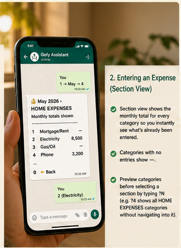
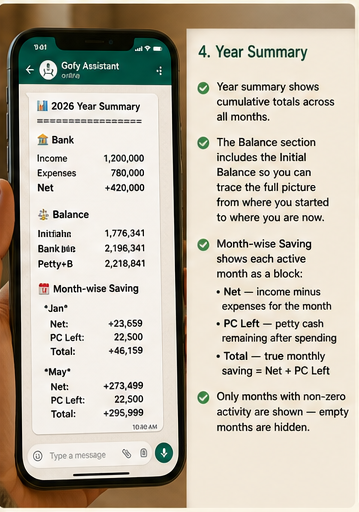
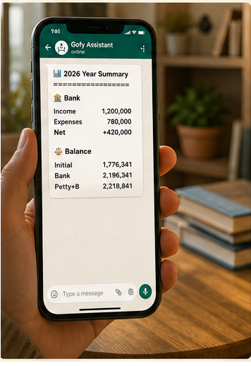

<div align="center">


# 🤖 Saving-Bot-v1.0

**A private WhatsApp budget management bot for your homelab.**  
No cloud. No subscriptions. No fees. Your data stays home.

[](https://nodejs.org)
[](https://github.com/pedroslopez/whatsapp-web.js)
[](https://docker.com)
[](https://github.com/exceljs/exceljs)
[](https://www.onlyoffice.com)
[](#-license)

> Type **`Gofy`** on WhatsApp to open the menu and start managing your budget in seconds.

</div>

---

## 📖 Table of Contents

- [What Is This?](#-what-is-this)
- [Features](#-features)
- [Prerequisites](#-prerequisites)
- [Folder Structure](#-folder-structure)
- [Installation](#-installation)
- [Configuration](#-configuration)
- [Adding WhatsApp Numbers](#-adding-whatsapp-numbers-to-whitelist)
- [Creating Your Year File](#-creating-your-year-excel-file)
- [Bot Keywords](#-bot-keywords)
- [How It Works — Screenshot Walkthrough](#-how-it-works--screenshot-walkthrough)
- [HTML Reports](#-html-reports)
- [Scheduled Backups](#-scheduled-backups)
- [Live Dashboard](#-live-dashboard)
- [In-Browser Excel Editor (OnlyOffice)](#-in-browser-excel-editor-onlyoffice)
- [Email Alerts](#-email-alerts)
- [Conflict Resolution](#-conflict-resolution)
- [Testing & Local Checks](#-testing--local-checks)
- [Troubleshooting](#-troubleshooting)
- [Security](#-security)
- [Contributing](#-contributing)
- [License](#-license)

---

## 💡 What Is This?

Saving-Bot-v1.0 is a **self-hosted WhatsApp budget assistant** that runs on your homelab — Raspberry Pi, Mini PC, VPS, or any always-on Linux machine. It connects to WhatsApp using a second SIM number and lets authorised family members log expenses and view financial summaries through a guided menu.

```
Your Phone ──WhatsApp──► Bot Number ──► Homelab ──► Saving-<Year>.xlsx
```

Your financial data never leaves your network. No third-party APIs, no monthly fees.

---

## ✨ Features

| Feature | Description |
|---|---|
| 📅 **Expense Entry** | Section → Category → Day flow with existing entries shown |
| 🏦 **Budget Management** | Update bank balance, petty cash, and starting balance |
| 📊 **Summary Views** | Month-wise and year-wise with Bank / Petty Cash / Balance sections |
| 📎 **Excel Download** | Send live `.xlsx` directly to WhatsApp |
| 🌐 **HTML Reports** | Interactive charts, date-pivot tables, and visual analysis |
| 📋 **Year Template** | Create `Saving-<Year>.xlsx` from template without leaving WhatsApp |
| 🔄 **Year Switching** | Switch active year on the fly |
| ⏰ **Scheduled Backups** | Auto-send Excel at 4 fixed times daily (PKT) |
| ⏸ **Backup Toggle** | Each user controls their own backup schedule |
| 🔒 **Whitelist Only** | Completely silent to all non-authorised numbers |
| ✏️ **Conflict Resolution** | 5-action menu when editing a cell that already has data |
| 📊 **Live Dashboard** | Web-based monitoring dashboard with SSE live updates |
| 🔑 **Dashboard Auth** | Token link, short URL (`is.gd`), and WhatsApp OTP login |
| 📝 **In-Browser Editor** | Edit Excel files live via OnlyOffice Document Server |
| 💾 **Auto-Backups** | Automatic versioned backups before every OnlyOffice save |
| 📧 **Email Alerts** | Dark-mode HTML emails for data changes and service events |
| 📅 **Day-End Report** | Nightly email with full categorised spending breakdown |
| 🧪 **SMTP Health Check** | Connectivity test and test email sent on every bot start |

---

## 🛠 Prerequisites

### Software

| Requirement | Version | Check |
|---|---|---|
| Docker | 20+ | `docker --version` |
| Docker Compose | v2+ | `docker compose version` |
| Git | Any | `git --version` (optional) |

> Docker installs Node.js 20, Chromium, and OnlyOffice Document Server automatically — nothing else needed on the host.

### Hardware

| Component | Minimum | Recommended |
|---|---|---|
| CPU | 2 cores | 4 cores |
| RAM | 1.5 GB free | 3 GB free |
| Storage | 2 GB | 5 GB |
| Network | Always-on | Wired preferred |

> **Note:** OnlyOffice Document Server requires ~1 GB RAM and takes 60–120 seconds to initialise on first boot. The bot container waits for it automatically via `depends_on: condition: service_healthy`.

Works on: Raspberry Pi 4 (4 GB+) · Mini PC (N100/N5095) · Any Ubuntu VPS · Old laptop

### WhatsApp

- A **second SIM/number** dedicated to the bot (any network)
- WhatsApp installed on a phone with that SIM — needed only for the **first QR scan**
- After scanning, the session is saved permanently — the phone can be put away

### Ports

| Port | Service | Direction |
|---|---|---|
| `3001` | Bot dashboard + editor API | Inbound (from your browser) |
| `8080` | OnlyOffice Document Server | Inbound (from your browser) |
| `443/80` | WhatsApp outbound only | Outbound only |

### Docker Install (Ubuntu/Debian)

A convenience script is included:

```bash
bash scripts/install-docker.sh
```

---

## 📁 Folder Structure

```
Saving-Bot-v1.0/
├── src/
│   ├── app/
│   │   └── bot.js                  ← WhatsApp client bootstrap + message routing
│   ├── config/
│   │   └── index.js                ← Loads .env, paths, settings + helpers
│   ├── handlers/
│   │   └── message-handler.js      ← Conversation state machine (all 9 menu options)
│   ├── services/
│   │   ├── dashboard.js            ← Express dashboard, SSE, auth, OTP
│   │   ├── editor.js               ← OnlyOffice Document Server integration
│   │   ├── excel.js                ← Excel read/write + HTML report generation
│   │   ├── mailer.js               ← Email alerts and dark-mode templates
│   │   └── scheduler.js            ← Scheduled backups + day-end email report
│   └── shared/                     ← Shared utilities/constants for future modules
├── assets/
│   ├── images/                     ← README screenshots
│   └── templates/
│       └── Template.xlsx           ← Blank year template (do not modify)
├── scripts/
│   └── install-docker.sh           ← Docker install script for Ubuntu/Debian
├── tests/
│   └── smoke.test.js               ← Module wiring and path smoke checks
├── package.json
├── docker-compose.yml              ← Two services: saving-bot-v1.0 + onlyoffice-ds
├── env.example                     ← Safe template — copy to .env
├── .env                            ← ⚠️ YOUR config — never commit to Git
├── Saving-Year/                    ← Auto/local: active budget files + backups
├── session/                        ← Auto/local: WhatsApp session data
├── wwebjs_cache/                   ← Auto/local: WhatsApp Web version cache
└── bot_settings.json               ← Auto/local: active year + user prefs
```

---

## 🚀 Installation

### Step 1 — Copy files to your homelab

```bash
mkdir ~/Saving-Bot-v1.0 && cd ~/Saving-Bot-v1.0
# Copy all bot files here
```

### Step 2 — Install Docker (if needed)

```bash
bash scripts/install-docker.sh
```

### Step 3 — Place your Excel file

```bash
mkdir -p Saving-Year
cp /path/to/Saving-2026.xlsx Saving-Year/Saving-2026.xlsx
# assets/templates/Template.xlsx should already exist
```

### Step 4 — Create your `.env` file

```bash
cp env.example .env
nano .env          # fill in your phone numbers and server IP
```

See [Configuration](#-configuration) for what to put in it.

### Step 5 — Generate secrets

```bash
# ONLYOFFICE_SECRET
openssl rand -hex 24

# ONLYOFFICE_JWT_SECRET (paste into .env; docker-compose passes it to JWT_SECRET)
openssl rand -hex 32
```

### Step 6 — Start the bot

```bash
docker compose up -d
docker compose logs -f saving-bot-v1.0
```

> **First boot:** OnlyOffice DS takes 60–120 s to initialise its internal database. The bot container waits for it — you will see the health check polling in Docker output. This is normal.

### Step 7 — Scan the QR code

The QR code prints in the logs on first start:

```
📱 Scan this QR code with the BOT WhatsApp number:

▄▄▄▄▄▄▄ ▄  ▄ ▄▄▄▄▄▄▄
...

Waiting for scan...
```

Open WhatsApp on the **bot's phone** → Settings → Linked Devices → Link a Device → Scan.

Once done:
```
🔐 Authenticated successfully
📊 Dashboard live → http://YOUR_IP:3001
✅ Saving-Bot-v1.0 is LIVE!
💬 Send "Gofy" to start
```

---

## ⚙ Configuration

All sensitive values live in a `.env` file — **never hardcoded, never committed to Git**.

### `.env` file

Copy the example and edit it:

```bash
cp env.example .env
nano .env
```

```ini
# ── Whitelist ──────────────────────────────────────────────────────────────────
# Comma-separated. Include BOTH phone format AND LID format for each person.
# How to find LIDs: see "Adding WhatsApp Numbers" section below.
WHITELIST=923111794795,161942429786177,9232441898958,133977293766855

# ── Scheduled backup recipients ────────────────────────────────────────────────
# Phone format only (no LIDs). Receive the Excel file 4× daily.
NOTIFY_NUMBERS=923111794795,9232441898958

# ── Template path ──────────────────────────────────────────────────────────────
TEMPLATE_PATH=assets/templates/Template.xlsx
YEAR_FOLDER=Saving-Year

# ── Timezone ───────────────────────────────────────────────────────────────────
TZ=Asia/Karachi

# ── Dashboard ──────────────────────────────────────────────────────────────────
DASHBOARD_PORT=3001
DASHBOARD_HOST=http://YOUR_SERVER_IP:3001

# ── OnlyOffice Document Server ─────────────────────────────────────────────────
ONLYOFFICE_DS_URL=http://YOUR_SERVER_IP:8080
BOT_CALLBACK_HOST=http://savingbot:3001
ONLYOFFICE_SECRET=change-me-generate-with-openssl-rand-hex-24
ONLYOFFICE_JWT_SECRET=change-me-generate-with-openssl-rand-hex-32

# ── Email Alerts ───────────────────────────────────────────────────────────────
SMTP_HOST=smtp.gmail.com
SMTP_PORT=587
SMTP_USER=your@gmail.com
SMTP_PASS=xxxx xxxx xxxx xxxx   # Google App Password (spaces OK — stripped automatically)
SMTP_FROM=your@gmail.com
ALERT_EMAIL=alert-recipient@gmail.com
```

### All environment variables

| Variable | Required | Default | Description |
|---|---|---|---|
| `WHITELIST` | ✅ | hardcoded | Comma-separated numbers (phone + LID formats) |
| `NOTIFY_NUMBERS` | ✅ | hardcoded | Numbers that receive scheduled Excel backups |
| `TEMPLATE_PATH` | | `assets/templates/Template.xlsx` | Path to blank year template |
| `YEAR_FOLDER` | | `Saving-Year` | Folder containing year workbooks and editor backups |
| `TZ` | | `Asia/Karachi` | Container timezone |
| `DASHBOARD_PORT` | | `3001` | Port for dashboard + editor |
| `DASHBOARD_HOST` | ✅ | auto-detect | Public URL for link generation (e.g. `http://65.x.x.x:3001`) |
| `ONLYOFFICE_DS_URL` | ✅ | auto-detect | Browser-facing URL of OnlyOffice DS (e.g. `http://65.x.x.x:8080`) |
| `BOT_CALLBACK_HOST` | ✅ | auto-detect | URL OnlyOffice DS uses to reach the bot (Docker alias recommended: `http://savingbot:3001`) |
| `ONLYOFFICE_SECRET` | ✅ | auto-generated | Shared secret for `/api/edit/serve` and `/api/edit/callback` |
| `ONLYOFFICE_JWT_SECRET` | ✅ | none | JWT signing secret — must match `JWT_SECRET` in `docker-compose.yml` |
| `SMTP_HOST` | | — | SMTP server (e.g. `smtp.gmail.com`) |
| `SMTP_PORT` | | `587` | SMTP port (587 = STARTTLS, 465 = SSL) |
| `SMTP_USER` | | — | SMTP login (your Gmail address) |
| `SMTP_PASS` | | — | SMTP password (Gmail App Password — spaces stripped automatically) |
| `SMTP_FROM` | | `SMTP_USER` | From address in outgoing emails |
| `ALERT_EMAIL` | | — | Comma-separated email recipients for all alerts |

> **Auto-detect fallback:** If `DASHBOARD_HOST`, `ONLYOFFICE_DS_URL`, or `BOT_CALLBACK_HOST` contain `YOUR_SERVER_IP` (the placeholder) or are unset, the dashboard/editor code queries `api.ipify.org` at startup and substitutes the detected public IP. For Docker deployments, keep `BOT_CALLBACK_HOST=http://savingbot:3001` unless OnlyOffice DS cannot reach the bot over the Docker network.

### How `src/config/index.js` uses it

`src/config/index.js` reads the `.env` file automatically on startup (no extra packages — pure Node.js). If a value is missing from `.env`, it falls back to hardcoded defaults. Docker Compose also passes the `.env` through via `env_file`.

```
.env  ──►  src/config/index.js  ──►  src/app/bot.js / src/handlers/message-handler.js
                                └──►  src/services/*.js
```

### What's protected by `.gitignore`

```
.env               ← your phone numbers + SMTP credentials + OnlyOffice secrets
session/           ← WhatsApp login session
bot_settings.json  ← active year + per-user backup prefs
Saving-Year/       ← your personal Excel budget files and backups
```

> ✅ **Safe to commit:** `env.example`, all `.js` files, `assets/templates/Template.xlsx`, `README.md`, `assets/images/`

---

## 🔍 Adding WhatsApp Numbers to Whitelist

Modern WhatsApp uses two ID formats for the same number. You need **both** in the whitelist.

| Format | Example | When used |
|---|---|---|
| Phone format | `923111794795` | Standard `@c.us` messages |
| LID format | `161942429786177` | Multi-device `@lid` messages |

### Step-by-step

**1. Start the bot and have the person send any message** (e.g. `hello`)

**2. Watch the logs:**

```bash
docker compose logs -f saving-bot-v1.0
```

**3. Look for the resolved line:**

```
🔍 Resolved 161942429786177@lid → 161942429786177
📩 [161942429786177] hello
```

Or phone format:

```
🔍 Resolved 923111794795@c.us → 923111794795
📩 [923111794795] hello
```

**4. Add both IDs to `.env`:**

```ini
# Before
WHITELIST=923111794795,161942429786177

# After — added new member
WHITELIST=923111794795,161942429786177,923331234567,188227495436364
#                                      ─────────────  ────────────────
#                                      phone format    LID format
```

**5. Restart:**

```bash
docker compose restart saving-bot-v1.0
```

**6. Verify** — they send `Gofy` and the main menu appears.

### Quick reference: reading the log line

```
🔍 Resolved 161942429786177@lid → 161942429786177
            ─────────────────────   ─────────────────
            strip @lid suffix       add this to WHITELIST
```

---

## 📊 Creating Your Year Excel File

### Option A — Via WhatsApp Bot ✅ Recommended

1. Send `Gofy` → select **6 — Create New Year Template**
2. Enter the year (e.g. `2027`)
3. Confirm → bot sends `Saving-2027.xlsx` to your WhatsApp
4. File is also saved to `Saving-Year/Saving-2027.xlsx` on your homelab
5. Select **7 — Switch Active Year** → enter `2027`

### Option B — Manually

```bash
cp assets/templates/Template.xlsx Saving-Year/Saving-2027.xlsx
```

Then open in Excel:
1. `Section-Category` sheet → cell D1: change `2026` → `2027`
2. Update date cells in rows 6–17 to the new year
3. `Budget` sheet → cell A1: change to `Budget Manager v1.0`

### Excel Row Reference

```
Section-Category worksheet:
  Row 5–11    INCOME
  Row 15–22   Petty Cash Used
  Row 26–28   Savings Expense
  Row 34–46   Home Expenses
  Row 50–59   Daily Living
  Row 63–70   Children
  Row 74–79   Transportation
  Row 83–87   Health
  Row 91–94   Education
  Row 98–101  Charity/Gifts
  Row 105–108 Obligations
  Row 119–129 Entertainment
  Row 140–145 Subscriptions
  Row 149–154 Vacation
  Row 158–160 Miscellaneous
  Row 164     Total Per Day (expense sections only, auto-computed)

Budget worksheet:
  Row 3  Col 1  Starting Balance (year-start bank amount)
  Row 11         Petty Cash allocation (per month column)
  Row 14         Current Petty Cash balance (computed fresh by bot)
  Row 20         Current Bank balance (computed fresh by bot)
```

---

## 🔑 Bot Keywords

| Keyword | Shown to users | Action |
|---|---|---|
| `Gofy` | ✅ Yes | Opens main menu |
| *(hidden keyword)* | ❌ No | Opens main menu silently |
| `Reset` | ✅ Yes | Resets current session |
| `help` | ✅ Yes | Shows all commands |
| `cancel` / `exit` | ✅ Yes | Ends session |
| `0` or `back` | ✅ Yes | Go one step back |
| `stop schedule` | ✅ Yes | Stop your scheduled backups |
| `start schedule` | ✅ Yes | Resume scheduled backups |
| `?N` | ✅ Yes | Preview section N (e.g. `?4`) |

### Main Menu Options

| Option | Label | Description |
|---|---|---|
| **1** | Enter Expense / Income | Section → Category → Day entry flow |
| **2** | Update Budget | Update Petty Cash, Bank Balance, or Starting Balance |
| **3** | View Summary | Month-wise or year-wise financial summary |
| **4** | Download Excel File | Sends live `.xlsx` to your WhatsApp |
| **5** | Export HTML Report | Month or full-year interactive HTML report |
| **6** | Create New Year Template | Create `Saving-<Year>.xlsx` from template |
| **7** | Switch Active Year | Change which year's file the bot operates on |
| **8** | Stop / Resume Backups | Toggle your personal scheduled backup preference |
| **9** | View Dashboard | Open dashboard monitoring + access link menu |

---

## 📱 How It Works — Screenshot Walkthrough

### 1 · Meet Gofy Assistant


> **Your personal finance companion on WhatsApp.**  
> Open with `Gofy` and manage money simply and stress-free — track expenses, view summaries, export reports, and stay in control of your budget without leaving WhatsApp.

---

### 2 · Opening the Bot


> **Type `Gofy` to open the main menu.**  
> The active year is shown at the top so you always know which file you're working in. Nine options cover every use case. Option 8 dynamically shows **Stop** or **Resume** based on your personal backup preference. Option 9 opens the live monitoring dashboard. Send `0` or `back` at any step to go one level up.

---

### 3 · Entering an Expense — Section View



> **Every category shows its monthly total so you instantly see what's already been entered.**  
> Categories with no entries show `—`. Type `?N` to preview the categories inside any section without navigating into it (e.g. `?4` lists all HOME EXPENSES categories). Select a category number to drill in.

---

### 4 · Entering an Expense — Day Selection


> **Previously filled days are listed with their current values before you enter a day.**  
> This prevents duplicate entries and makes updating existing values straightforward. Enter a day number to add a new entry or overwrite an existing one. Enter `0` to clear the cell.  
> If the cell already contains data, the **Conflict Resolution** menu appears — see [Conflict Resolution](#-conflict-resolution).

---

### 5 · Viewing a Monthly Summary


> **Three clear sections mirror your Excel structure exactly.**  
>
> - 🏦 **Bank** — income, expenses (bank transactions only, petty cash excluded), and net  
> - 💵 **Petty Cash** — allocated cash, amount spent, and remaining balance in hand  
> - ⚖️ **Balance** — running bank balance (cumulative from starting balance) and total savings including petty cash  
>
> All values are computed fresh from raw cell data — never from Excel's stale formula cache.

---

### 6 · Year Summary





> **Cumulative totals across all months with a month-by-month saving breakdown.**  
>
> The Balance section shows the **Initial Balance** so you can trace from where the year started to where it is now. Month-wise Saving shows each active month as a block:
> - **Net** — income minus expenses
> - **PC Left** — petty cash remaining after spending
> - **Total** — true monthly saving (Net + PC Left)
>
> Only months with non-zero activity are shown — empty months are hidden automatically.

---

## 🌐 HTML Reports

Send `Gofy` → **5 — HTML Report** → choose month or full year.  
The bot sends an `.html` file — open in your phone's browser for the full interactive report.

### Month Report

- **Summary cards** — Petty Cash (Available / Used / Left) · Bank (Income / Expenses / Net) · Balance (Bank / Petty+Bank)
- **📂 Sections tab** — scrollable category tabs per section with monthly totals
- **📊 Section Breakdown tab** — date-pivot table with Total Per Day row + per-section category breakdown
- **Visual Analysis** — expense pie chart by section + income pie + per-section category pies (below each tab)

### Year Report

- **Year totals** at top (same summary cards + Initial Balance)
- **Month tabs** (Jan → Dec) — each has full Sections + Section Breakdown tabs with visual analysis
- Only months with data render content; empty months show a placeholder

---

## ⏰ Scheduled Backups

All `.xlsx` files in `Saving-Year/` are sent automatically to `NOTIFY_NUMBERS`:

| Time (PKT) | Cron expression | Extra action |
|---|---|---|
| 11:15 AM | `15 11 * * *` | — |
| 4:20 PM | `20 16 * * *` | — |
| 8:30 PM | `30 20 * * *` | — |
| 11:50 PM | `50 23 * * *` | Triggers day-end email report |

Each family member can independently stop or resume their backups via Option 8 or by sending `stop schedule` / `start schedule`. Preferences survive bot restarts.

---

## 📊 Live Dashboard

A web-based monitoring dashboard is included. It auto-starts when the bot comes online and is accessible from any browser on your network (or over the internet if the port is open).

### Accessing the Dashboard

**Option A — WhatsApp link (recommended):**
1. Send `Gofy` → `9` → `1` (Preview)
2. The bot generates a short URL via `is.gd` (or a direct `/go/<code>` link as fallback)
3. Clicking the link logs you in automatically — no token entry needed

**Option B — Raw Access Token:**
1. Send `Gofy` → `9` → `2` (Generate Access Token)
2. Copy the token shown
3. Open `http://YOUR_SERVER_IP:3001` in your browser
4. On the **Access Token** tab, paste the token and click Sign In

**Option C — WhatsApp OTP (browser login):**
1. Open `http://YOUR_SERVER_IP:3001` in your browser
2. Click the **WhatsApp Code** tab
3. Enter your whitelisted phone number (with country code, no `+` or spaces)
4. Click **Send Code** — the bot delivers a 6-digit code to your WhatsApp
5. Enter the code in the browser to log in

### Dashboard Panels

| Panel | Description |
|---|---|
| **Status Bar** | Bot online/offline pill with animated dot, uptime since start, dark/light theme toggle |
| **Stat Cards** | Bot status · Whitelisted user count · Active dashboard sessions · Budget Balance (Can Use) · Balance Left |
| **Scheduled Jobs** | All 4 cron schedules with human-readable labels and cron expressions |
| **Whitelisted Numbers** | Masked phone number chips (e.g. `923****794`) |
| **Send Dashboard Code** | In-dashboard OTP panel — send and verify login codes for other users without going to WhatsApp |
| **Current Month Summary** | Live Balance, Bank, and Petty Cash financials; auto-refreshes when data changes |
| **Year Report** | Full year HTML report embedded inline (same output as Export HTML → Year Overview), with a manual Refresh button; auto-refreshes when bot data changes |
| **Live Activity Log** | Last 50 incoming and outgoing messages with masked numbers, timestamps, and direction arrows |

### Dashboard Controls via WhatsApp

```
Gofy → 9
  1  → Get your access link (short URL or /go/:code fallback)
  2  → Get your raw token (paste on the login page)
  3  → Start / Stop the dashboard server
  0  → Back to main menu
```

### Real-time Updates (SSE)

The dashboard connects to `/events` via **Server-Sent Events** for live push updates. The full state (bot status, whitelist, schedules, activity log, month summary) is broadcast to all connected clients whenever any value changes. A polling fallback (`/api/data`, every 30 s) handles environments where SSE connections drop.

When the month summary's `dataVersion` increments (i.e. a value was written to Excel), the embedded year report automatically reloads and a toast notification appears.

### Authentication Details

- **Tokens** are persistent — no expiry. One stable token per whitelisted number. Reuse the same token indefinitely.
- **Short codes** (8-char hex) map to tokens via `/go/:code` redirect. Short URLs are cached via `is.gd` (one call per code per bot lifetime).
- **Sessions** last 30 days (cookie `dsid`) and are cleared in memory when the dashboard server is stopped.
- **OTP codes** are 6 digits, expire in 5 minutes, allow 3 attempts before requiring a new code, with a 60-second resend cooldown. IP-based rate limiting: max 3 OTP requests per IP per 10 minutes.
- Only whitelisted phone numbers (phone format, no `@c.us`) can request OTP codes.

### Dashboard URL Configuration

```ini
# .env
DASHBOARD_PORT=3001
DASHBOARD_HOST=http://YOUR_SERVER_IP:3001
```

Open the firewall port:
```bash
ufw allow 3001/tcp
```

---

## 📝 In-Browser Excel Editor (OnlyOffice)

The bot ships with full in-browser spreadsheet editing powered by **OnlyOffice Document Server**, running as a second Docker container on the same `bot-net` network.

### Accessing the Editor

Navigate to `http://YOUR_SERVER_IP:3001/edit` (or click the **Open File** link from the dashboard — the editor is session-protected). You must be logged in to the dashboard to access the editor.

### File Picker

The file picker at `/edit` lists all `.xlsx` files found in `Saving-Year/`:

- Displays file size, last modified date, and backup count per file
- Click **📝 Open in OnlyOffice** to launch the full-screen editor
- Click the **🗂** button to browse and download versioned backups for that file
- A status banner shows the detected OnlyOffice DS URL and file count

### How Saves Work

1. You edit the file in the full-screen OnlyOffice editor
2. OnlyOffice auto-saves (and force-saves) the document
3. DS calls the bot's `/api/edit/callback` endpoint with a download URL
4. The bot downloads the updated file from DS and writes it to `Saving-Year/`
5. **Before every write**, a timestamped backup is created in `Saving-Year/backups/`

### Backup System

| Detail | Value |
|---|---|
| Location | `Saving-Year/backups/` |
| Naming format | `Saving-2026_2026-05-03T22-15-00.xlsx` |
| Max per file | 20 (oldest are deleted automatically) |
| Trigger | Every OnlyOffice save callback (status `2` = ready-to-save, `6` = force-save) |

To download a backup: open the file picker → click 🗂 on the file → pick a version → click **⬇ Download**.

### OnlyOffice Configuration

```ini
# .env
ONLYOFFICE_DS_URL=http://YOUR_SERVER_IP:8080    # Browser-facing URL (user's device → DS)
BOT_CALLBACK_HOST=http://savingbot:3001            # DS-to-bot URL (Docker internal alias)
ONLYOFFICE_SECRET=<openssl rand -hex 24>         # Secures /serve and /callback routes
ONLYOFFICE_JWT_SECRET=<openssl rand -hex 32>     # JWT signing for OnlyOffice 8+/9+
```

**Two-URL model:**

```
Browser ───────────────────────► ONLYOFFICE_DS_URL:8080  (loads the editor JS)
OnlyOffice DS ─────────────────► BOT_CALLBACK_HOST       (downloads xlsx, posts saves)
                                   ↑ container-to-container; never leaves Docker network
```

> ⚠️ **Common misconfiguration:** `BOT_CALLBACK_HOST` must be reachable by the OnlyOffice DS container — not by your browser. Inside Docker, use the dot-free network alias from `docker-compose.yml` (e.g. `http://savingbot:3001`). Docker DNS can misparse names with dots such as `saving-bot-v1.0`; if saves fail silently, switch to the alias or to the server's reachable IP.

### JWT Signing

OnlyOffice DS 8+ / 9+ has JWT enabled by default. The `ONLYOFFICE_JWT_SECRET` in `.env` must match `JWT_SECRET` in `docker-compose.yml` (under the `onlyoffice-ds` service environment). The bot signs the document config payload using HS256 when the secret is set; if unset, JWT signing is skipped (only safe when DS JWT is also disabled).

### Route Reference

| Route | Auth | Description |
|---|---|---|
| `GET /edit` | Session | File picker page |
| `GET /edit/open?file=xxx.xlsx` | Session | Full-screen OnlyOffice editor |
| `GET /api/edit/files` | Session | List xlsx files in `Saving-Year/` |
| `GET /api/edit/config?file=xxx` | Session | OnlyOffice document config JSON |
| `GET /api/edit/backups?file=xxx` | Session | List backups for a file |
| `GET /api/edit/backup-download?name=xxx` | Session | Download a specific backup |
| `GET /api/edit/serve/:file?secret=xxx` | Secret token | Stream xlsx to OnlyOffice DS |
| `POST /api/edit/callback?file=xxx&secret=xxx` | Secret token | OnlyOffice save/status webhook |

---

## 📧 Email Alerts

The bot sends styled **dark-mode HTML email alerts** via SMTP (tested with Gmail). All emails share the same design language as the dashboard (dark navy background, gradient accent bars, monospace font).

### Setup (Gmail)

1. Enable **2-Factor Authentication** on your Google account
2. Go to **Google Account → Security → App Passwords**
3. Generate an App Password for "Mail" (16 characters)
4. Add to `.env`:
   ```ini
   SMTP_HOST=smtp.gmail.com
   SMTP_PORT=587
   SMTP_USER=your@gmail.com
   SMTP_PASS=xxxx xxxx xxxx xxxx   # spaces stripped automatically
   SMTP_FROM=your@gmail.com
   ALERT_EMAIL=recipient@gmail.com
   ```

> **Multiple recipients:** `ALERT_EMAIL` accepts comma-separated addresses, e.g. `you@gmail.com,partner@gmail.com`.

> **Disabling email:** Leave `SMTP_HOST`, `SMTP_USER`, or `SMTP_PASS` empty. All alert calls skip silently — the bot continues normally.

### SMTP Connectivity Check on Startup

Every time the bot starts, `mailer.testSmtp()` runs automatically:

1. Prints a diagnostic table showing which env vars are set vs. missing
2. Calls `transport.verify()` to test the SMTP connection
3. If successful, sends a startup test email to confirm end-to-end delivery

```
📧 [SMTP] Config diagnostic:
   ✅  SMTP_HOST      = smtp.gmail.com
   ✅  SMTP_PORT      = 587
   ✅  SMTP_USER      = your@gmail.com
   ✅  SMTP_PASS      = set (16 chars)
   ✅  ALERT_EMAIL    = you@gmail.com
   ✅  nodemailer     = installed
📧 [SMTP] Testing connection to smtp.gmail.com:587...
📧 [SMTP] Connection OK — sending startup test email...
📧 [SMTP] Test email delivered successfully.
```

### Alert Types

| Alert | Trigger | Email content |
|---|---|---|
| ✅ **Bot Online** | Bot ready event at startup | Status, SMTP host, timestamp |
| 🔴 **Bot Down** | WhatsApp `disconnected` event | Disconnect reason, restart policy note |
| 🔐 **Auth Failure** | WhatsApp `auth_failure` event | Error detail, fix instructions (delete session + rescan QR) |
| ➕ **Value Added** | New cell entry (was empty) | Section, category, month, day, new amount, phone number |
| 📎 **Value Appended** | Append action in conflict menu | Appended value, new formula parts, new total, before/after comparison |
| 🗑️ **Value Deleted** | Delete action in conflict menu | Deleted part, remaining parts, remaining total |
| ✏️ **Value Changed** | Change action in conflict menu | Old part value → new value, new total |
| 🔄 **Value Replaced** | Replace action in conflict menu | Old total → new single value |
| 📊 **Day-End Report** | 11:50 PM PKT every day (if spending > 0) | Full breakdown by section and category |
| 🧪 **SMTP Test** | Every bot startup (if SMTP configured) | Confirms delivery is working |

### Day-End Spending Report

The 11:50 PM scheduled job sends a comprehensive spending report email for the day. It includes:

- **Stat cards**: Total Spent · Bank · Petty Cash · Income (if recorded)
- **Per-section breakdown**: Each section with colour-coded header, category rows sorted by amount, formula parts shown inline where values were split across multiple entries (e.g. `= 1,200 + 800`)
- **Subtotal** per section
- **Grand Total bar** at the bottom

Only sections with actual spending are shown. If no data was entered that day (`hasData = false`), the email is skipped entirely.

---

## ✏️ Conflict Resolution

When you try to edit a cell that already contains data — a single value or a formula like `=1200+800` — the bot presents a **5-action conflict resolution menu** instead of silently overwriting.

This applies to both **expense cells** (Section → Category → Day) and **budget cells** (Update Budget → Field → Month).

### The 5 Actions

| Option | Action | What it does |
|---|---|---|
| **1** | 📎 **Append** | Adds a new amount to the existing formula: `=1200+800` → `=1200+800+500` |
| **2** | 🗑 **Delete** | Shows all formula parts; you pick which index to remove |
| **3** | ✏️ **Change** | Shows all formula parts; you pick which index to change, then enter new value |
| **4** | 🔄 **Replace** | Replaces the entire formula with a single new formula value |
| **5** | ➕ **Add** | Overwrites the cell with a plain number (no formula wrapper) |
| **0** | ⬅ **Cancel** | Returns to day selection (or month selection for budget) |

### Example — Append Flow

```
You: Gofy → 1 → May → Home Expenses → Electricity → 15
Bot: ⚠️ Value Exists — Day 15
     Current formula parts:
       1.  1,200
       2.    800
       Total: 2,000
     1 Append  2 Delete  3 Change  4 Replace  5 Add  0 Cancel

You: 1
Bot: Enter the value to append:
You: 500
Bot: ✅ Appended!
     Formula: 1,200 + 800 + 500
     Total:   2,500
```

### Example — Delete Flow

```
You: 2
Bot: 🗑 Delete a Part
     1.  1,200
     2.    800
     0 Back

You: 2
Bot: ✅ Deleted!
     Removed: 800
     Remaining: 1,200
```

### Email Notification on Conflict Actions

Each resolved conflict (Append, Delete, Change, Replace) triggers an email alert with a **before/after comparison block**, showing the formula parts before and after the change with colour-coded diff styling.

---

## 🧪 Testing & Local Checks

Use these commands before opening a pull request or after changing the bot code:

| Command | What it verifies |
|---|---|
| `npm install` | Installs the Node.js dependencies used by the bot and smoke tests |
| `npm test` | Runs `tests/smoke.test.js`, which validates module wiring, required paths, and core config arrays |
| `npm run check` | Runs `node --check` against the app entrypoint and every JavaScript file under `src/` and `tests/` |
| `docker compose config` | Validates the Compose file after editing services, ports, or environment wiring |

For a full runtime check, start the stack with `docker compose up -d`, then watch `docker compose logs -f saving-bot-v1.0` until the QR code or ready message appears.

---

## 🔧 Troubleshooting

| Problem | Fix |
|---|---|
| QR code expired | `docker compose restart saving-bot-v1.0` |
| Bot not responding to `Gofy` | Add both phone format AND LID to `WHITELIST` in `.env` — [see guide](#-adding-whatsapp-numbers-to-whitelist) |
| Chromium lock error | `rm -f session/session/SingletonLock && docker compose restart saving-bot-v1.0` |
| Session lost | `rm -rf session/ && docker compose restart saving-bot-v1.0` then rescan QR |
| `[object Object]` in report | Formula cell with no cache — bot computes these fresh; check Budget sheet |
| Petty Cash Left shows 0 | Ensure `pettyCashAvailable` is set in Budget sheet row 11 for at least one month |
| Excel styling lost on save | ExcelJS fully preserves styles — check you're using the latest `src/services/excel.js` |
| `node-cron not found` | `docker compose down && docker compose up -d` to trigger full npm reinstall |
| `@lid` blocked messages on startup | Normal — WhatsApp internal sync noise, safely ignored |
| `.env` changes not taking effect | `docker compose restart saving-bot-v1.0` |
| Dashboard shows "Offline" | Bot not yet ready; wait for `✅ Saving-Bot-v1.0 is LIVE!` in logs |
| Dashboard login link broken | Ensure `DASHBOARD_HOST` in `.env` uses your server's public IP, not `localhost` |
| OTP code never arrives via WhatsApp | Check bot is fully started; ensure the number is in `WHITELIST` (phone format only, no `@c.us`) |
| OTP "Too many requests" | IP rate limit hit (3 requests per 10 min); wait and try again |
| Dashboard report not refreshing | Click the **↺ Refresh** button; if blank, check `/report` in bot logs for Excel errors |
| OnlyOffice editor blank / "Cannot reach DS" | `ONLYOFFICE_DS_URL` must be the **browser-facing** IP:8080 — not the Docker container name |
| OnlyOffice DS not ready | First boot takes 60–120 s; run `docker logs onlyoffice-ds` and wait for health check |
| File saves in OnlyOffice don't persist | Check `BOT_CALLBACK_HOST` — DS must reach the bot. Use `http://savingbot:3001` or a reachable IP, not the dotted container name |
| `401 Unauthorized` in OnlyOffice callback logs | `ONLYOFFICE_SECRET` mismatch — ensure `.env` value matches what was set at startup |
| JWT error in OnlyOffice | `ONLYOFFICE_JWT_SECRET` in `.env` must exactly match `JWT_SECRET` in `docker-compose.yml` |
| Email alerts not sending | `docker logs saving-bot-v1.0 \| grep SMTP` — check the startup diagnostic table |
| `SMTP Connection FAILED` | Wrong `SMTP_PASS` — use the 16-char **App Password**, not your Google account password |
| Day-end email not received | Confirm spending was recorded that day (`hasData = true`); check 11:50 PM cron fired |
| Backup not created before save | Check write permissions on `Saving-Year/backups/`; non-fatal — save still proceeds |

### Essential Commands

```bash
# Live logs
docker compose logs -f saving-bot-v1.0
docker compose logs -f onlyoffice-ds

# Restart bot only (keeps OnlyOffice DS running)
docker compose restart saving-bot-v1.0

# Full rebuild + reinstall
docker compose down && docker compose up -d

# Fix Chromium lock
rm -f session/session/SingletonLock
docker compose restart saving-bot-v1.0

# Check OnlyOffice health
curl http://localhost:8080/healthcheck

# Generate fresh secrets
openssl rand -hex 24    # ONLYOFFICE_SECRET
openssl rand -hex 32    # ONLYOFFICE_JWT_SECRET

# Container status
docker compose ps
```

---

## 🔒 Security

- Non-whitelisted numbers receive **zero response** — not even an error
- Phone numbers stored in `.env` — excluded from Git via `.gitignore`
- Session data stored locally in `./session/` — never leaves your machine
- Excel files and backups stay in `Saving-Year/` on your homelab — excluded from Git
- No inbound ports required by WhatsApp (outbound HTTPS/WSS only)
- `bot_settings.json` stores only active year and per-user backup preferences
- Dashboard tokens are persistent but non-guessable (32 random bytes = 64-char hex)
- Short codes (8-char hex) map to tokens via a separate lookup — revoking a number clears both the token and its short code
- OTP codes are 6-digit, single-use, expire in 5 minutes, and allow only 3 attempts before requiring a new code
- IP-based rate limiting on OTP: max 3 requests per IP per 10 minutes
- Dashboard sessions last 30 days and are cleared from memory when the server stops
- All displayed phone numbers in the dashboard are masked (e.g. `923****794`)
- `/api/edit/serve` and `/api/edit/callback` routes are secured by a shared secret — not guessable without access to `.env`
- JWT signing protects document configs passed to OnlyOffice DS (`ONLYOFFICE_JWT_SECRET`)
- Email alerts contain no plain-text passwords or secrets — only financial data summaries

---

## 🤝 Contributing

Contributions are welcome! If you find a bug, have a feature idea, or want to improve the docs, feel free to open an issue or submit a pull request.

### How to contribute

1. **Fork** the repository
2. **Create a branch** for your change: `git checkout -b feature/your-feature-name`
3. **Commit** your changes with a clear message: `git commit -m "feat: add your feature"`
4. **Push** to your fork: `git push origin feature/your-feature-name`
5. **Open a Pull Request** — describe what you changed and why

### Guidelines

- Keep pull requests focused — one feature or fix per PR
- Test your changes locally with Docker before submitting
- Never commit `.env`, `session/`, or any personal data files
- Follow the existing code style (Node.js `'use strict'`, async/await)

### Reporting issues

Please include the following in any bug report:
- Node.js and Docker version (`node --version`, `docker --version`)
- Relevant log output (`docker compose logs saving-bot-v1.0`)
- Steps to reproduce the issue

---

## 📄 License

```
MIT License

Copyright (c) 2026 Mirza Nehal Baig

Permission is hereby granted, free of charge, to any person obtaining a copy
of this software and associated documentation files (the "Software"), to deal
in the Software without restriction, including without limitation the rights
to use, copy, modify, merge, publish, distribute, sublicense, and/or sell
copies of the Software, and to permit persons to whom the Software is
furnished to do so, subject to the following conditions:

The above copyright notice and this permission notice shall be included in all
copies or substantial portions of the Software.

THE SOFTWARE IS PROVIDED "AS IS", WITHOUT WARRANTY OF ANY KIND, EXPRESS OR
IMPLIED, INCLUDING BUT NOT LIMITED TO THE WARRANTIES OF MERCHANTABILITY,
FITNESS FOR A PARTICULAR PURPOSE AND NONINFRINGEMENT. IN NO EVENT SHALL THE
AUTHORS OR COPYRIGHT HOLDERS BE LIABLE FOR ANY CLAIM, DAMAGES OR OTHER
LIABILITY, WHETHER IN AN ACTION OF CONTRACT, TORT OR OTHERWISE, ARISING FROM,
OUT OF OR IN CONNECTION WITH THE SOFTWARE OR THE USE OR OTHER DEALINGS IN THE
SOFTWARE.
```

> This project is open source under the **MIT License**. You are free to use, modify, and distribute it — personal or commercial — as long as the original copyright notice is retained. The full license text is included in this section.

---

<div align="center">

Built with ❤️ for family budget management

**Saving-Bot-v1.0** · Open Source · MIT License

[⭐ Star this repo](../../stargazers) · [🐛 Report a bug](../../issues) · [💡 Request a feature](../../issues)

</div>